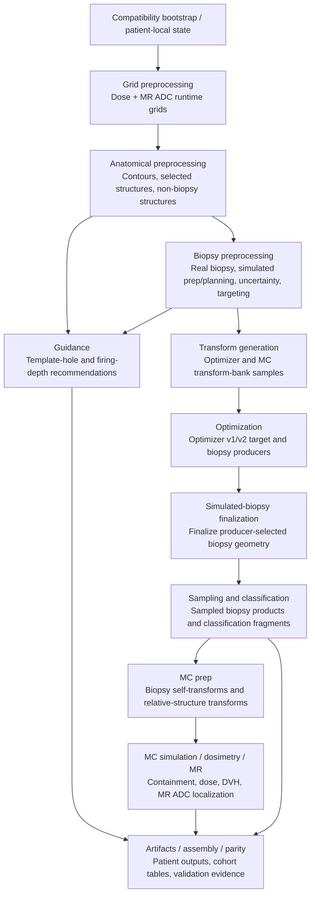

# Patient Runner Dependency Graph

Last updated: 2026-06-04

This document describes the intended dependency model for patient-runner
scientific orchestration. The executable code lives in
`python_files_dcm_meta_based/patient_runner/scientific_dependencies.py`, which
now carries two views: the full scientific graph slice and the currently
executable adapter slice. This note remains the conceptual guide for graph
changes as coarse stages are split further.

## Core Position

The dependency graph should be the source of truth for scientific runner
assembly.

- A graph node is one scientific dependency unit.
- A patient stage adapter is the currently executable runner surface for one or
   more graph nodes while migration is still coarse.
- A dependency is a required predecessor relationship between nodes.
- A pathway is a user-configured scientific workflow through the graph.
- A tranche is a removable debug/documentation grouping over nodes.

Tranches are useful labels, but they should not own dependency policy. If a
tranche grouping conflicts with the dependency graph, the graph wins.

## Why The Runner Opts In Through Stage Adapters

Scientific modules should remain passive and reusable in their owning scientific
packages. They should not register themselves with the patient runner or decide
whether they run.

The runner should opt into stage adapters through layered config:

```text
scientific module
-> patient-runner stage adapter
-> stage config
-> pathway/run config
-> runner execution
```

This keeps scientific code independent from runner policy, GUI choices, batch
execution, and shadow-validation modes. It also gives the runner one place to
reject render/debug side effects and one place to validate incompatible stage
combinations before mutating heavy patient state.

## Tree Versus Graph

The current workflow can often be drawn like a tree or a mostly linear spine,
but the implementation should treat it as a directed acyclic graph. That leaves
room for shared prerequisites and later joins without rewriting the model.

A tree-style view is still useful for discussion:

```text
bootstrap
-> grid preprocessing
-> anatomical preprocessing
-> biopsy preprocessing
   -> optimization-oriented work
   -> MC/dosimetry-oriented work
```

The graph view is safer for implementation because output/guidance/parity may
need products from more than one upstream branch. A node can have multiple
parents. For example, current full outputs may depend on both optimizer outputs
and MC/dosimetry outputs.

## Current Visual DAG

The live runner should enter through a named pathway, then expand that pathway
to these dependency-checked per-patient stage adapters. Tranches may describe
these blocks for planning/debug, but the pathway/DAG expansion is the execution
authority.



Current named pathway expansion:

| Pathway | Execution slice |
| --- | --- |
| `anatomical_qa` | grid preprocessing -> anatomical preprocessing |
| `biopsy_preprocessing_shadow` | grid preprocessing -> anatomical preprocessing -> biopsy preprocessing |
| `optimization_shadow` | grid preprocessing -> anatomical preprocessing -> biopsy preprocessing -> transform generation -> optimization |
| `current_dosimetry_shadow` | grid preprocessing -> anatomical preprocessing -> biopsy preprocessing -> transform generation -> optimization -> simulated-biopsy finalization -> sampling/classification -> MC prep -> MC simulation |
| `full_current_pipeline_shadow` | all current executable scientific stages, including guidance |

The main entrypoint now has an opt-in patient scientific runner hook with three
modes: `disabled`, `plan_only`, and `execute`.

| Mode | Meaning | Mutates patient state through live runner? | Expected artifact |
| --- | --- | --- | --- |
| `disabled` | Do not build or run the live scientific runner hook. | No | None |
| `plan_only` | Build typed config, validate checkpoint/pathway agreement, expand the DAG-valid stage list, and write the plan. | No | `patient_scientific_runner_plan.json` |
| `execute` | Do everything in `plan_only`, then run the expanded per-patient stages through the batch runner. | Yes | plan JSON plus patient/batch run manifests |

The runner should move outward by checkpoint rather than jumping directly to the
full pathway. Each checkpoint maps to exactly one named pathway.

| Checkpoint | Pathway | Purpose | Next checkpoint |
| --- | --- | --- | --- |
| `anatomical_qa` | `anatomical_qa` | First live runner checkpoint: grid preprocessing plus anatomical preprocessing. | `biopsy_preprocessing_shadow` |
| `biopsy_preprocessing_shadow` | `biopsy_preprocessing_shadow` | Adds biopsy-facing preprocessing after anatomical products exist. | `optimization_shadow` |
| `optimization_shadow` | `optimization_shadow` | Adds transform generation and optimizer-v1/v2 adapters. | `current_dosimetry_shadow` |
| `current_dosimetry_shadow` | `current_dosimetry_shadow` | Adds simulated-biopsy finalization, sampling/classification, MC prep, dose, and MR ADC simulation. | `full_current_pipeline_shadow` |
| `full_current_pipeline_shadow` | `full_current_pipeline_shadow` | Runs all current executable scientific stages, including guidance. | none |

For the first overnight run, the intended switch set is `execute` plus
`anatomical_qa`, with `SHADOW_OUTPUT` patient-runner validation enabled after the
legacy oracle finishes. That combination tests the smallest live per-patient
science slice while still writing post-run patient-runner assembly validation
evidence.

## Pathway Meaning

A pathway is not an efficiency choice and should not be guessed by the runner.
It is an intentional user/config choice describing the scientific workflow to
execute or validate.

Examples:

- anatomical QA pathway
- biopsy preprocessing shadow pathway
- optimization pathway
- current MC/dosimetry pathway
- full current pipeline pathway

The current MC/dosimetry pathway depends on biopsy preprocessing and later biopsy
state. It is not a path that skips the biopsy path.

## Calling A Node Directly

Most users should request a pathway, not an isolated downstream node. A direct
stage request is still useful for tests or debugging, but it should only be
allowed when one of these is true:

- all hard prerequisites are also enabled in the requested graph slice,
- the caller explicitly declares the upstream products as already satisfied,
- the run is a controlled validation/debug mode that allows incomplete graphs.

The normal behavior should be fail-fast validation, not silent downstream skip
or implicit auto-disable.

## Current Hard Dependency Map

This is the conservative current map based on the legacy main order and current
patient-runner adapters.

| Node | Scope | Hard prerequisites | Provides |
| --- | --- | --- | --- |
| input discovery and bootstrap | run/cohort | none | patient case inputs, DICOM paths, modality routing, legacy key names, output roots, initial legacy runtime dictionaries |
| compatibility bootstrap/reference boundary | runner bridge | discovered patient inputs and legacy dictionaries | one-patient runtime/reference/info state |
| grid preprocessing | patient | compatibility bootstrap/reference boundary | dose-grid runtime objects, MR ADC input normalization, MR ADC grid runtime objects |
| anatomical preprocessing | patient | compatibility bootstrap/reference boundary; grid preprocessing when MR/dose-derived anatomical products are enabled | raw contours, selected/unique structures, standard non-biopsy geometry/shape/MR summaries, prostate-only MR ADC summary |
| biopsy preprocessing | patient | anatomical preprocessing | real-biopsy geometry, simulated-biopsy preparation/planning, uncertainty attachment, early targeting annotations, sampled-biopsy outputs currently still grouped here |
| transform generation | patient/run config plus patient mutation | biopsy preprocessing; MC/optimizer transform settings | transform-bank samples used by optimizer and later MC prep |
| optimization | patient | anatomical preprocessing; biopsy preprocessing; transform generation when optimizer-v2/search requires transform samples | optimizer-v1/v2 target-ranking and optimized biopsy outputs |
| simulated-biopsy realization/finalization | patient | simulated-biopsy preparation/planning; a selected simulated-biopsy producer; optimization for the current legacy-shadow pathway | finalized simulated-biopsy geometry, planned-vs-realized validation fragments, post-producer targeting annotations |
| sampling and classification | patient plus run assembly | finalized biopsy geometry | sampled-biopsy point storage, biopsy-frame coordinates, double-sextant sample-point fragments, run-level per-voxel classification assembly |
| MC prep | patient | finalized/sampled biopsy state; anatomical structures; transform settings | biopsy self-transforms and relative-structure transforms |
| MC simulation / current dosimetry | patient | MC prep; anatomical structures; biopsy state; dose grid for dose simulation; MR ADC grid for MR simulation | containment, dose, dose-gradient, DVH, and MR ADC localization outputs |
| guidance/output/parity | mixed patient and run/cohort | selected pathway products | guidance-map recommendations, patient artifacts, cohort assembly, post-run parity |

The dependency module encodes this split graph while still exposing a separate
currently executable adapter order. Transform generation, simulated-biopsy
finalization, and sampling/classification now have patient-runner adapters. MC
prep now covers MC transform application after finalized and sampled biopsy
state. The current executable dependency for simulated-biopsy finalization uses
optimization as the producer because that matches the legacy-shadow pathway; it
is not a statement that every simulated-biopsy source must be optimizer-based.
The graph and executable adapter names are aligned for the current named nodes,
while later internal slices such as double-sextant classification can be added
inside the sampling/classification stage boundary.

## Simulated-Biopsy Producer Contract

Simulated-biopsy finalization should depend on a selected simulated-biopsy
producer, not permanently on one optimizer implementation. Today the current
legacy-shadow pathway satisfies that producer contract through optimization,
because legacy finalization happens after optimizer-v2. Future pathways can add
other producers, such as optimizer-v1, centroid-derived biopsy state, or a
manual/configured simulated-biopsy source, without changing the downstream
finalization, sampling/classification, MC prep, or MC simulation stage names.

## Candidate Pathway Presets

The implementation supports named pathway presets rather than forcing callers to
manually list every stage. Each pathway has a full graph-node slice and a current
executable adapter slice. Those slices now use the same current stage names; the
full graph view still remains useful for documenting later internal splits.

| Pathway | Intended use | Required graph slice |
| --- | --- | --- |
| anatomical_qa | Validate anatomical preprocessing in isolation | bootstrap -> grid preprocessing -> anatomical preprocessing |
| biopsy_preprocessing_shadow | Validate biopsy preprocessing after anatomical products exist | bootstrap -> grid preprocessing -> anatomical preprocessing -> biopsy preprocessing |
| optimization_shadow | Validate optimizer-oriented patient stages | bootstrap -> grid preprocessing -> anatomical preprocessing -> biopsy preprocessing -> transform generation -> optimization |
| current_dosimetry_shadow | Validate current MC/dosimetry behavior | bootstrap -> grid preprocessing -> anatomical preprocessing -> biopsy preprocessing -> transform generation -> current simulated-biopsy producer through optimization -> finalization -> sampling/classification -> MC prep -> MC simulation |
| full_current_pipeline_shadow | Validate the full current scientific pathway plus outputs | all current scientific nodes plus guidance/output/parity |

These names are provisional. The important rule is that pathway names encode
scientific intent. The runner should not choose a pathway because it is shorter
or faster.

## Tranche Role

Tranches should remain easy to remove.

Keep them as:

- debug blocks,
- documentation labels,
- readable summaries for manifests,
- optional group selectors that expand to graph nodes.

Do not make them:

- the dependency source of truth,
- scientific implementation homes,
- patient discovery owners,
- a reason to bypass graph validation.

If pathway presets make tranches redundant later, tranches can be deleted or
kept only as manifest labels.

## Near-Term Implementation Plan

1. Keep the full graph-node view and current executable adapter view in the
   patient-runner dependency module.
2. Keep pathway presets as explicit named graph slices that expand to graph
   nodes and current adapter slices.
3. Validate requested stage/pathway selections before building `PatientStage`s.
4. Treat tranches as optional labels that must resolve to valid graph slices.
5. Support an explicit already-satisfied prerequisite set for loaded
   preprocessed bundles and other controlled validation states.
6. Keep simulated-biopsy finalization tied to a producer contract; the current
   pathway uses optimization as that producer, while later centroid/manual
   pathways should register their own producer choice.
7. Run named pathways through an explicit scientific-shadow validation mode that
   writes evidence under its own root and defaults to deep-copying carved
   patient state before mutating scientific stages execute.
8. Add durable stage-state evidence manifests, including performed/skipped/error
   status, metadata keys, output paths, and dataframe snapshots or shapes where
   useful.
9. Add later internal sampling/classification slices, especially double-sextant
   fragments, behind the existing sampling/classification stage boundary.